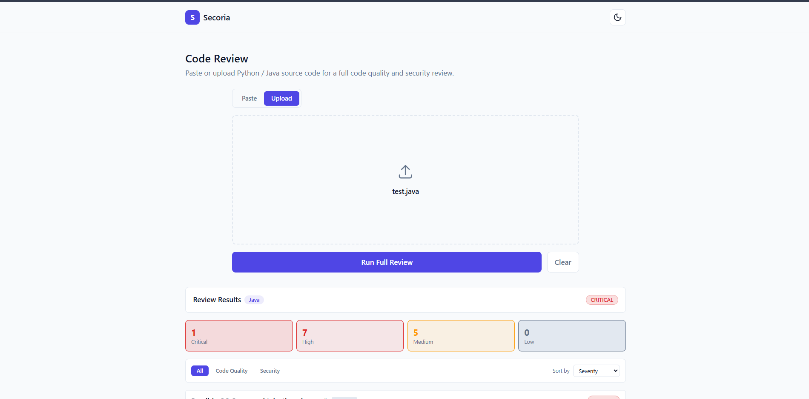
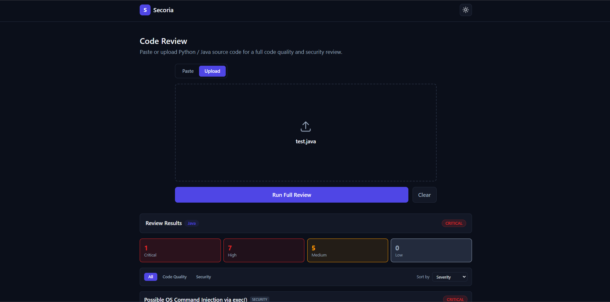

# Secoria

**AI Code Review & Security Analysis Agent**
*Infosys Springboard Internship Project*

Secoria is an intelligent, multi-agent platform that automatically analyzes source code for quality issues, security vulnerabilities, and best-practice violations — reducing manual code review effort and accelerating secure development.

> **Current Status:** Milestone 2 Complete (Code Analysis Agent + Security Vulnerability Agent + Multi-Agent Orchestration + Findings Display & Severity Scoring Module)

---

## Table of Contents

- [Project Vision](#project-vision)
- [Milestone Progress](#milestone-progress)
- [Architecture](#architecture)
- [Folder Structure](#folder-structure)
- [Tech Stack & Dependencies](#tech-stack--dependencies)
- [Installation](#installation)
- [Features](#features)
- [Screenshots](#screenshots)
- [Future Scope](#future-scope)
- [License](#license)

---

## Project Vision

Software teams struggle with inconsistent code quality, undetected security vulnerabilities, and slow manual reviews. Secoria addresses this with a multi-agent AI pipeline:

| Agent | Responsibility | Status |
|---|---|---|
| Code Analysis Agent | Detects code smells, design anti-patterns, complexity issues | ✅ Milestone 2 |
| Security Vulnerability Agent | Scans for OWASP-standard vulnerabilities (injection, insecure deserialization, hardcoded secrets, weak crypto, etc.) with severity and location-specific flagging | ✅ Milestone 2 |
| Multi-Agent Orchestrator | Runs both agents concurrently, merges findings into one prioritized, deduplicated report | ✅ Milestone 2 |
| Remediation Agent | Generates fix recommendations with corrected code | Future |
| PR Summary Agent | Compiles findings into a human-readable review summary | Future |
| Conversational Code Assistant | RAG-powered Q&A grounded in secure coding knowledge base | Future |

---

## Milestone Progress

- [x] **Milestone 1 — Foundations** ✅ Complete & verified
  - [x] System architecture & folder structure designed
  - [x] Code Submission Module (paste/upload Python & Java, language detection, syntax validation)
  - [x] Secure Coding Knowledge Base — 5 self-authored reference docs + 9 official OWASP Cheat Sheet Series PDFs (Authorization, Authentication, Cryptographic Failures, Deserialization, Input Validation, Secrets Management, SQL Injection, SSL/TLS, XML Security), chunked & embedded → ChromaDB — **306 chunks indexed**
- [x] **Milestone 2 — Multi-Agent Orchestration & Analysis Pipeline** ✅ Complete & verified
  - [x] Code Analysis Agent (code smells, cyclomatic + cognitive complexity, God Object detection, naming conventions) — Python & Java
  - [x] Security Vulnerability Agent (OWASP-mapped detection: injection, insecure deserialization, weak hashing, disabled TLS, hardcoded credentials, insecure randomness) — Python & Java, location-specific flagging
  - [x] Multi-agent orchestration — concurrent dispatch (`asyncio.gather` + thread pool), merged/prioritized/deduplicated findings via `/api/review`
  - [x] Findings Display & Severity Scoring Module — unified frontend dashboard with severity summary cards (also act as filters), source-agent filter, sort control, full-width layout
  - [x] External tool integration — Bandit, Semgrep, Pylint, Flake8 running alongside our own custom rules for broader, less-narrow detection coverage
  - [x] **45/45 backend tests passing**
- [ ] Milestone 3 — Code Review Report Generation & Export
- [ ] Milestone 4 — Conversational Code Assistant (RAG retriever + chat UI), Remediation Agent, PR Summary Agent

---

## Architecture

Secoria is a **monorepo** with three independently runnable systems, connected by stable data contracts and a shared data artifact (the ChromaDB knowledge base).

```
┌─────────────────┐        HTTP (JSON)        ┌───────────────────────────┐
│  React Frontend  │ ────────────────────────► │      FastAPI Backend       │
│  (Vite + Tailwind)│ ◄──────────────────────── │      (Layered/Clean)       │
└─────────────────┘                            │                             │
                                                │  ┌───────────────────────┐  │
                                                │  │      Orchestrator      │  │
                                                │  │  (concurrent dispatch,  │  │
                                                │  │   merge & prioritize)   │  │
                                                │  └──────────┬─────────┬──┘  │
                                                │             │         │     │
                                                │    ┌────────▼──┐  ┌───▼────┐│
                                                │    │Code Analysis│ │Security ││
                                                │    │   Agent    │  │  Agent  ││
                                                │    └────────────┘  └────────┘│
                                                └───────────────────────────┘
                                                              │
                                                              │ (Milestone 4 reads)
                                                              ▼
                                                    ┌──────────────────┐
                                                    │  ChromaDB Vector  │
                                                    │  Store (built by   │
                                                    │  knowledge-base/)  │
                                                    └──────────────────┘
```

The backend follows a **layered (Clean) architecture**:

```
api/           → HTTP routes only (thin controllers): submission, analysis, security, orchestration
services/      → Business logic (language detection, syntax validation) — reused unchanged by every agent
models/        → Pydantic request/response schemas (per-module contracts)
core/          → Config, logging (cross-cutting concerns)
agents/        → code_analysis/, security/ (remediation/, pr_summary/ still reserved for later)
orchestrator/  → Coordinates agents; not itself an agent — a sibling to agents/, not nested inside it
```

This design follows the **Open/Closed Principle**: every agent and the Orchestrator were added without modifying Milestone 1's `services/` or `models/` code — proven in practice across two full milestones now, not just claimed on paper.

Full reasoning for every architectural decision — including alternatives considered and trade-offs accepted — is documented in [`docs/decision-log.md`](docs/decision-log.md). This is the single most useful document for mentor review Q&A.

---

## Folder Structure

```
secoria/
├── backend/                    FastAPI application
│   ├── app/
│   │   ├── api/                  submission.py, analysis.py, security.py, orchestration.py
│   │   ├── core/                  Config & logging
│   │   ├── models/                 submission_schema.py, analysis_schema.py, security_schema.py
│   │   ├── services/                Language detection & syntax validation (shared by all agents)
│   │   ├── agents/
│   │   │   ├── code_analysis/        Code Analysis Agent — code smells, complexity, design issues
│   │   │   └── security/              Security Vulnerability Agent — OWASP-mapped vulnerability detection
│   │   └── orchestrator/             Concurrent agent dispatch + merge/prioritize/deduplicate logic
│   ├── tests/                     45 tests across submission, both agents, and the orchestrator
│   └── requirements.txt
├── frontend/                   React + Vite + Tailwind UI
│   └── src/
│       ├── components/            CodeEditor (syntax highlighting + line numbers), FileUpload,
│       │                           FindingsDashboard (severity cards, filters, sort), ThemeToggle
│       ├── context/                 ThemeContext (dark/light mode)
│       └── services/                  API client (submitCode, scanSecurity, runReview)
├── knowledge-base/             Offline ingestion pipeline
│   ├── documents/                 5 self-authored .md docs + 9 official OWASP Cheat Sheet PDFs
│   ├── scripts/                    loader → chunker → embedder → build_kb
│   └── chroma_store/                Persisted vector database (generated, gitignored)
├── docs/
│   ├── decision-log.md
│   └── milestone-1-presentation-script.md
├── LICENSE
└── README.md
```

---

## Tech Stack & Dependencies

### Backend
| Package | Purpose |
|---|---|
| `fastapi` | Web framework — async, auto-generated OpenAPI docs, Pydantic-native validation |
| `uvicorn` | ASGI server to run the FastAPI app |
| `python-multipart` | Enables `UploadFile` handling for file uploads |
| `pydantic` | Data validation and schema definitions (contract between frontend/backend) |
| `javalang` | Pure-Python Java syntax parser and AST — used for syntax validation, and both agents' Java analyzers, no JDK required |
| `radon` | Computes Cyclomatic Complexity and Maintainability Index for Python (Code Analysis Agent) |

**External CLI tools (installed via `pipx`, NOT in `requirements.txt` — see Decision Log):**

| Tool | Purpose |
|---|---|
| `bandit` | Established Python security scanner — broadens Security Agent coverage beyond our own hand-written rules |
| `semgrep` | Multi-language (Python + Java) security & code-smell scanner with community-maintained rule registry |
| `pylint` | Established Python code quality linter — broadens Code Analysis Agent coverage |
| `flake8` | Python style/logic checker (PEP 8 + Pyflakes) |

> **Why `pipx`, not `pip install` into `requirements.txt`:** installing `semgrep` directly into the backend's virtual environment was tested and confirmed to break FastAPI — its dependency chain silently overwrites `starlette` to an incompatible version. These tools are invoked as isolated subprocess commands instead, never imported as Python libraries. Full incident write-up in `docs/decision-log.md`.

### Frontend
| Package | Purpose |
|---|---|
| `react` | UI library, component-based architecture |
| `vite` | Fast dev server & build tool |
| `tailwindcss` | Utility-first styling, native dark-mode support |
| `prismjs` | Syntax tokenization for code highlighting (Python & Java) |
| `react-simple-code-editor` | Lightweight (~2KB) textarea-with-highlighting overlay — chosen over Monaco/CodeMirror to stay dependency-proportionate |

### Knowledge Base
| Package | Purpose |
|---|---|
| `langchain` | Document loading & chunking orchestration |
| `langchain-community` | Community document loaders (PDF, text, etc.) |
| `langchain-chroma` | LangChain ↔ ChromaDB integration |
| `chromadb` | Local, file-based vector database |
| `sentence-transformers` | Generates embeddings locally (free, no API key) |
| `pymupdf` | PDF text extraction |
| `posthog<3.0.0` | Pinned to match `chromadb`'s expected telemetry API (fixes a version-incompatibility bug — see Decision Log) |

> Each dependency is explained in depth — why it was chosen, what it replaces, and mentor Q&A — in the corresponding module's section of `docs/decision-log.md`.

---

## Installation

```powershell
# External CLI tools (one-time, system-wide — used by Security & Code Analysis agents)
pip install --user pipx
pipx ensurepath
# close and reopen your terminal here, then:
pipx install bandit
pipx install pylint
pipx install flake8
pipx install semgrep

# Backend
cd backend
python -m venv venv
venv\Scripts\activate
pip install -r requirements.txt
uvicorn app.main:app --reload

# Frontend
cd frontend
npm install
npm run dev

# Knowledge Base (one-time build)
# NOTE: requires Python 3.12 specifically (not 3.13) — see docs/decision-log.md
cd knowledge-base
py -3.12 -m venv venv
venv\Scripts\activate
pip install -r requirements.txt
python scripts/build_kb.py
```

**API endpoints** (once the backend is running, full interactive docs at `http://localhost:8000/docs`):

| Endpoint | Purpose |
|---|---|
| `POST /api/submit` | Language detection + syntax validation only (Milestone 1) |
| `POST /api/analyze` | Code Analysis Agent only |
| `POST /api/security-scan` | Security Vulnerability Agent only |
| `POST /api/review` | **Orchestrated review** — both agents, merged findings (used by the main UI) |

---

## Features

**Submission (Milestone 1)**
- Paste Python or Java code into a syntax-highlighted editor with line numbers, or upload `.py`/`.java` files
- Automatic programming language detection and syntax validation
- Fully responsive UI with dark and light mode

**Code Review (Milestone 2)**
- One-click **"Run Full Review"** — dispatches Code Analysis and Security agents concurrently
- Code smell, complexity (cyclomatic + cognitive), and design anti-pattern detection (God Object, high complexity)
- OWASP-mapped security vulnerability detection with severity and exact line/code-snippet location
- **External tool integration**: Bandit and Semgrep (security), Pylint and Flake8 (code quality) run alongside our own custom rules, broadening detection coverage well beyond a hand-picked rule list — isolated via `pipx` to avoid dependency conflicts with the backend
- Unified findings dashboard: severity summary cards (double as clickable filters), source-agent filter, sort by severity or line number
- Secure coding knowledge base indexed from official OWASP Cheat Sheet Series PDFs plus self-authored reference docs — 306 chunks (ready for Milestone 4's RAG retriever)

---

## Screenshots

| Light Mode | Dark Mode |
|---|---|
|  |  |

---

## Future Scope

- RAG-powered conversational assistant grounded in the secure coding knowledge base (Milestone 4)
- Remediation Agent — generates corrected code examples per finding (Milestone 4)
- PR Summary Agent — human-readable review summary compiling all findings (Milestone 4)
- Exportable PDF/Markdown code review reports (Milestone 3)
- CI/CD integration (GitHub Actions bot for automated PR reviews)

---

## License

This project is licensed under the [MIT License](LICENSE).
